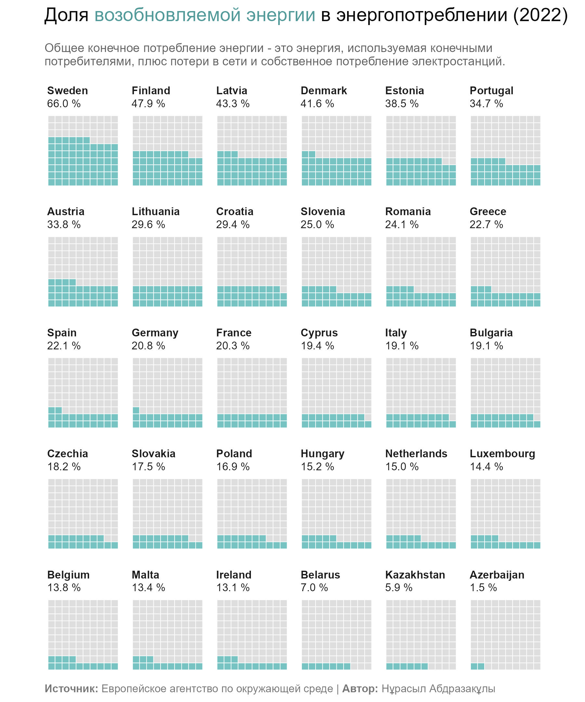

# Renewable energy in total energy consumption (2022) in Europe

I have made a visualization of the share of renewable energy in total energy consumption (2022) in Europe 🌀

This visualization is called "Waffles"

Used libraries in R : tidyverse, ggtext, here, waffle, readr.

Finland and Sweden are the leaders in the share of renewable energy in Europe. Finland is actively developing biomass and hydropower, and Sweden is known for its hydropower projects and wind energy 🌿🌊💨

🇪🇸 Spain 🇮🇹 Italy is actively developing solar energy using its sunny climate.

Ireland has the lowest share of renewable energy among the European Union countries, at 13.1%.

🇰🇿 According to the Ministry of Energy of the Republic of Kazakhstan, the share of renewable energy in the total volume of electricity production should be up to 10% by 2030, and by 2050 renewable and alternative energy sources should account for at least half of the total energy consumption.
